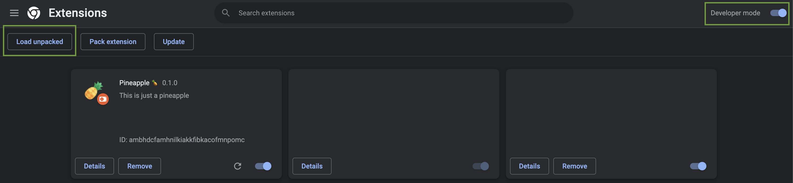

# Pineapple 🍍

~~This is just a pineapple.~~

The pineapple is a lie. Pineapple is a browser extension that intercepts and mocks requests made by the dApps to check if your address is blocked by a centralised entity or not. Did you suddenly lose access to the frontend of the famous DeFi dApps? Then this extension is for you. This extension is ready to use, no configuration is required. Install it and enjoy freedom again.

> For the moment, this extension only works on Chromium (Chrome/Microsoft Edge/Brave...). More compatibility would coming soon.

# How to install the extension

<details>
  <summary>For developers</summary>
  
`pnpm` is required for this repository, before anything else, please install it [following the official documentation](https://pnpm.io/installation).

Once `pnpm` installed, run these command to install the dependencies and build the extension

```bash
pnpm i && pnpm build -- --zip
```

At the root of the repository, a new directory called `build` has been created. This directory should have a file called `chrome-mv3-prod.zip`. You will need it for the last step.gi

</details>

<details>
  <summary>For non-developers</summary>

Go to the [release page](https://github.com/qd-qd/pineapple/releases) of this repository and download the extension fromgi the last release.

</details>

Now open your browser, go to the `chrome://extensions` page, enable the developer mode and click on the "Load unpacked" button. Upload the .zip file you previously generated or download.



That's it, the extension is installed and it will automatically do what it has to do without any intervention from you.

---

Pineapple icons created by [Umeicon - Flaticon](https://www.flaticon.com/free-icons/pineapple)
